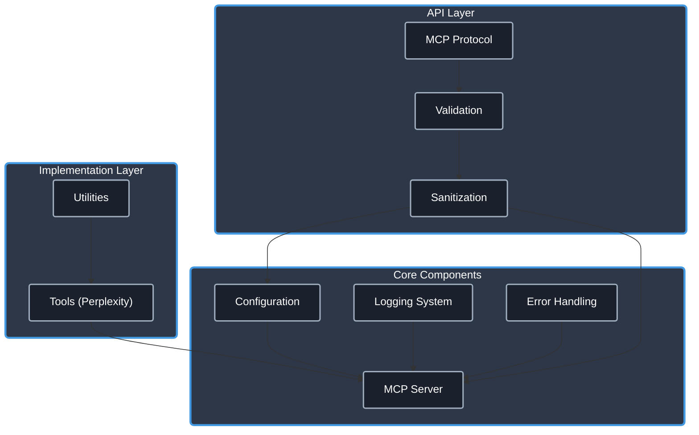

# Perplexity MCP Server

[](https://www.typescriptlang.org/)
[](https://modelcontextprotocol.io/)
[]()
[](https://opensource.org/licenses/Apache-2.0)
[](https://github.com/casey/perplexity-mcp-server/issues) <!-- Assuming repo path, adjust if needed -->
[](https://github.com/cyanheads/perplexity-mcp-server) <!-- Assuming repo path, adjust if needed -->

An MCP server providing tools to interact with the [Perplexity AI API](https://docs.perplexity.ai/docs/getting-started), built using the [mcp-ts-template](https://github.com/cyanheads/mcp-ts-template). This server allows AI agents compatible with the [Model Context Protocol (MCP)](https://modelcontextprotocol.io/) to leverage Perplexity's search-augmented query capabilities. Includes a showThinking parameter to enable reasoning models to show its internal reasoning process.

## Core Features

- **Utilities**: Reusable components for logging, error handling, ID generation, rate limiting, and request context management.
- **Type Safety**: Strong typing with TypeScript.
- **Error Handling**: Robust error handling system.
- **Security**: Basic security features like input sanitization.
- **Perplexity Tool**: A ready-to-use tool for interacting with the Perplexity Search API.

> **.clinerules**: This repository includes a [.clinerules](.clinerules) file that serves as a developer cheat sheet for LLM coding agents (like Cline) providing quick references for codebase patterns, file locations, and code snippets specific to this project.

## Table of Contents

- [Overview](#overview)
  - [What is Model Context Protocol?](#what-is-model-context-protocol)
  - [Architecture & Components](#architecture--components)
- [Features](#features)
  - [Core Utilities](#core-utilities)
  - [Type Safety](#type-safety)
  - [Error Handling](#error-handling)
  - [Security](#security)
  - [Perplexity Search Tool](#perplexity-search-tool)
- [Installation](#installation)
- [Configuration](#configuration)
- [Project Structure](#project-structure)
- [Tool Documentation](#tool-documentation)
  - [perplexity_search](#perplexity_search)
- [Development Guidelines](#development-guidelines)
  - [Adding a New Tool](#adding-a-new-tool)
  - [Adding a New Resource](#adding-a-new-resource)
- [License](#license)

## Overview

### What is Model Context Protocol?

Model Context Protocol (MCP) is a framework that enables AI systems to interact with external tools and resources. It allows language models to:

- Execute **tools** that perform actions and return results
- Access structured **resources** that provide information
- Create contextual workflows through standardized interfaces

This server allows AI systems to use the Perplexity API via MCP.

### Architecture & Components

The server is based on the `mcp-ts-template` and follows its modular architecture:

<details>
<summary>Click to expand architecture diagram</summary>



</details>

Core Components:

- **Configuration System**: Environment-aware configuration with validation
- **Logging System**: Structured logging with sensitive data redaction
- **Error Handling**: Centralized error processing with consistent patterns
- **MCP Server**: Protocol implementation for tools
- **Validation Layer**: Input validation and sanitization using `validator` and `sanitize-html`.
- **Utilities**: Reusable utility functions for common operations

## Features

### Core Utilities

- **Logging**: Configurable logging with file rotation and sensitive data redaction
- **Error Handling**: Pattern-based error classification and standardized reporting
- **ID Generation**: Secure unique identifier creation with prefix support
- **Rate Limiting**: Request throttling to prevent API abuse
- **Request Context**: Request tracking and correlation
- **Sanitization**: Input validation and cleaning using `validator` and `sanitize-html`.
- **Cost Tracking**: Estimation of Perplexity API costs based on model and token usage

### Type Safety

- **Global Types**: Shared type definitions for consistent interfaces
- **Error Types**: Standardized error codes and structures
- **MCP Protocol Types**: Type definitions for the MCP protocol
- **Tool Types**: Interfaces for tool registration and configuration

### Error Handling

- **Pattern-Based Classification**: Automatically categorize errors based on message patterns
- **Consistent Formatting**: Standardized error responses with additional context
- **Error Mapping**: Custom error transformation for domain-specific errors
- **Safe Try/Catch Patterns**: Centralized error processing helpers

### Security

- **Input Validation**: Using `validator` for various data type checks.
- **Input Sanitization**: Using `sanitize-html` to prevent injection attacks.
- **Parameter Bounds**: Enforced limits within sanitization logic to prevent abuse.
- **Sensitive Data Redaction**: Automatic redaction in logs.

### Perplexity Search Tool

- **[perplexity_search](src/mcp-server/tools/perplexitySearch/)**: The core tool provided by this server, enabling interaction with the Perplexity Search API.

## Installation

### Prerequisites

- [Node.js (v18+)](https://nodejs.org/)
- [npm](https://www.npmjs.com/) or [yarn](https://yarnpkg.com/)
- A Perplexity API Key (see [Configuration](#configuration))

### Setup

1. Clone this repository:

   ```bash
   # Replace with the actual repository URL if different
   git clone https://github.com/casey/perplexity-mcp-server.git
   cd perplexity-mcp-server
   ```

2. Install dependencies:

   ```bash
   npm install
   ```

3. Build the project:

   ```bash
   npm run build
   ```

## Configuration

### Environment Variables

This server requires the following environment variables:

| Variable                            | Description                                       | Default Value     |
| ----------------------------------- | ------------------------------------------------- | ----------------- |
| `PERPLEXITY_API_KEY`                | API key for authentication with Perplexity        | (Required)        |
| `PERPLEXITY_DEFAULT_MODEL`          | Default model to use for Perplexity requests      | "sonar-reasoning" |
| `PERPLEXITY_DEFAULT_SEARCH_CONTEXT` | Search context size ('low', 'medium', 'high')     | "high"            |
| `LOG_LEVEL`                         | Logging level ("debug", "info", "warn", "error")  | "info"            |
| `NODE_ENV`                          | Runtime environment ("development", "production") | "development"     |

### MCP Client Settings

Add this server to your MCP client settings (e.g., in VS Code or Claude Desktop):

```json
{
  "mcpServers": {
    "perplexity": {
      "command": "node",
      "args": ["/path/to/perplexity-mcp-server/dist/index.js"],
      "env": {
        "PERPLEXITY_API_KEY": "YOUR_PERPLEXITY_API_KEY"
      }
    }
  }
}
```

Replace `/path/to/perplexity-mcp-server/dist/index.js` with the actual path to the built server file and `YOUR_PERPLEXITY_API_KEY` with your key.

### Configuration System (Internal)

The internal configuration system manages settings:

- **Environment Config**: Loads settings like the API key from environment variables.
- **Validation**: Validates configuration values (e.g., search context size).
- **Logging**: Logs warnings for missing or invalid configuration.

## Project Structure

The codebase follows a modular structure within the `src/` directory:

```
src/
├── config/           # Configuration management
├── index.ts          # Main entry point
├── mcp-server/       # MCP server implementation
│   ├── server.ts     # Server setup and registration
│   └── tools/        # Tool implementations
│       └── perplexitySearch/
│           ├── index.ts
│           ├── logic.ts
│           └── registration.ts
├── services/         # External service integrations
│   ├── index.ts
│   └── perplexityApi.ts
├── types-global/     # Global type definitions
│   ├── errors.ts
│   ├── mcp.ts
│   └── tool.ts
└── utils/            # Utility functions
    ├── costTracker.ts
    ├── errorHandler.ts
    ├── idGenerator.ts
    ├── index.ts
    ├── logger.ts
    ├── rateLimiter.ts
    ├── requestContext.ts
    └── sanitization.ts
```

For a detailed, up-to-date view of the project structure, run:

```bash
npm run tree
```

## Tool Documentation

### perplexity_search

The `perplexity_search` tool performs search-augmented queries using the Perplexity API. It takes a natural language query, performs a web search using Perplexity's backend, and then uses an LLM to synthesize an answer based on the search results.

#### Input Parameters

| Parameter                  | Type     | Required | Description                                                                                                       |
| -------------------------- | -------- | -------- | ----------------------------------------------------------------------------------------------------------------- |
| `query`                    | string   | Yes      | The primary search query or question to be processed by Perplexity                                                |
| `return_related_questions` | boolean  | No       | When true, instructs the Perplexity model to suggest related questions alongside the main answer (Default: false) |
| `search_recency_filter`    | string   | No       | Filter search results by timeframe (e.g., 'day', 'week', 'month', 'year')                                         |
| `search_domain_filter`     | string[] | No       | Limit search to specific domains (e.g., ['wikipedia.org'])                                                        |
| `showThinking`             | boolean  | No       | Include the model's internal reasoning in the response (Default: false)                                           |

#### Examples

Basic usage:

```json
{
  "query": "What are the latest developments in quantum computing?"
}
```

Advanced usage:

```json
{
  "query": "What are the latest developments in quantum computing?",
  "return_related_questions": true,
  "search_recency_filter": "month",
  "search_domain_filter": ["nature.com", "science.org", "arxiv.org"],
  "showThinking": true
}
```

## Development Guidelines

This project uses the structure and guidelines from the `mcp-ts-template`.

### Adding a New Tool

Follow the template's guidelines:

1.  **Create Directory**: `src/mcp-server/tools/yourNewTool/`
2.  **Define Logic & Schema**: `logic.ts` (Input/Output types, validation schema, core function).
3.  **Implement Registration**: `registration.ts` (Import logic, schema, use `ErrorHandler.tryCatch` and `server.tool()`).
4.  **Export Registration**: `index.ts` (Export registration function).
5.  **Register in Server**: `src/mcp-server/server.ts` (Import and call registration function).

### Adding a New Resource

Resources are not the primary focus of this server, but if needed, follow the template's guidelines:

1.  **Create Directory**: `src/mcp-server/resources/yourNewResource/`
2.  **Define Logic & Schema**: `logic.ts` (Param types, query schema, core function).
3.  **Implement Registration**: `registration.ts` (Import logic, schema, define `ResourceTemplate`, use `ErrorHandler.tryCatch` and `server.resource()`).
4.  **Export Registration**: `index.ts` (Export registration function).
5.  **Register in Server**: `src/mcp-server/server.ts` (Import and call registration function).

## License

This project is licensed under the Apache License 2.0 - see the [LICENSE](LICENSE) file for details.

---

<div align="center">
Built with the <a href="https://modelcontextprotocol.io/">Model Context Protocol</a>
</div>
